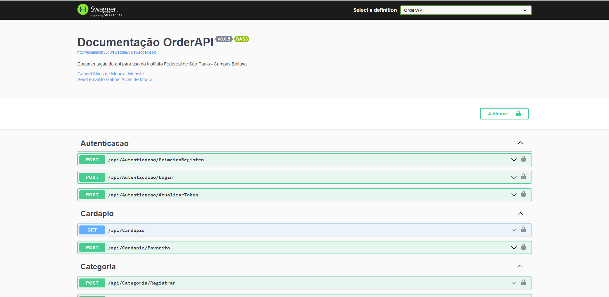

# OrderAPI

Order API, projeto proposto como monografia para o curso de Analise e Desenvolvimento de Sistemas, onde o intuito é de oferecer um ambiente melhor para os alunos por meio de uma API.

O projeto surgiu no momento em que vimos uma possibilidade de diminuir as filas geradas no momento de comprar algum salgado, bedida ou doce no estabelecimento do Instituto Federal de Educação, Ciência e Tecnologia de São Paulo. 

Onde o principal ideia é que os alunos possam apenas pedir o seu pedido, e apenas ir buscar no horário que estiver disponível.


## Swagger

Swagger é um framework para documentação de APIs, que nos permite criar um ambiente de facil utilização para requisiçoes HTTP.

<p align="center">  </p>

E para ter acesso a esta pagina de documentação da API, e necessario que a aplicação esteja rodando em um servidor, tendo como base a utilização local da API, a URL para acessar a documentação seria: `http://localhost:5000/swagger`, é usada a porta 5000 pois é a padrão utilizada pelo .NET.

## Sobre o Projeto

No projeto foi utilizado:
  - [C#](https://docs.microsoft.com/pt-br/dotnet/csharp/), como principal linguagem de programação. versão 9.0
  - [DotNet Core](https://docs.microsoft.com/pt-br/dotnet/) como framework para o desenvolvimento do projeto. versão: 5.0
  - [Entity Framework](https://docs.microsoft.com/pt-br/ef/) como framework para o desenvolvimento do projeto. versão: 5.0.0
  - [MySQL](https://www.mysql.com/) como banco de dados. versão: 8.0.18


## Configuração do Projeto

Para uso do projeto algumas credenciais devem ser informadas, como:
  - Dados para gerenciamento do banco de dados.
  - Dados para gerenciamento de Envio de Emails.

E todos esses dados dever ser informados no arquivo `appsettings.json`, ou se esta usando em ambiente de desenvolvimento, no arquivo `appsettings.Development.json`.


## Banco de Dados

Todos os comandos que vão ser executados para configurar o banco de dados, devem ser executados no diretorio do projeto Data.
`..\OrderAPI\OrderAPI.Data\`,

### Comandos para Migration

Para gerar uma nova migration, basta executar o comando:
```
dotnet ef --startup-project ..\OrderAPI.API migrations add ****
```
Lembrando que é necessario alterar o nome da migration para que ela seja gerada corretamente.

Para remover uma migration, basta executar o comando:
```
dotnet ef --startup-project ..OrderAPI.API migrations remove
```
E se for necessario excluir uma migration especifica, basta executar o comando abaixo, trocar os asteristicos por o nome da migration:
```
dotnet ef --startup-project ..\OrderAPI.API migrations remove ****
```

### Comandos para Banco

Para atualizar o banco de dados utilizando as migrations e tambem o framework `EntityFramework`, basta executar o comando:
```
dotnet ef --startup-project ..\OrderAPI.API  database update
```

## Publicação do Projeto

Para publicar o projeto é necessario executar o comando `dotnet publish -c Release`, para publicar o projeto em modo de desenvolvimento é necessario executar o comando `dotnet publish -c Debug`.

Depois de executado os comandos acima é gerado varios arquivos que vão ser usados para publicar a api em algum servidor.

### Linux

O comandos que serão executados a seguir, são somente para a publicação do serviço no servidor linux. e para que eles  sejam executados, é necessario que o usuario esteja logado como root.

Algums diretorios e arquivos devem estar preparados para a publicação. como no caso do comando a seguir, o caminho do diretorio `/var/www/html/OrderAPI/` deve estar preparado para a publicação.

O nome do servico que vai ser usado para a publicação do projeto, e de gosto de quem for publicar entretanto como o projeto é chamado de orderapi, nada mais justo dar o proprio nome para os seriviço criado do linux.

Os comandos que devem ser executados são:
```
    sudo systemctl stop orderapi.service &&
    sudo dotnet publish -c Release --output /var/www/orderapi/ &&
    sudo systemctl start orderapi.service
```
